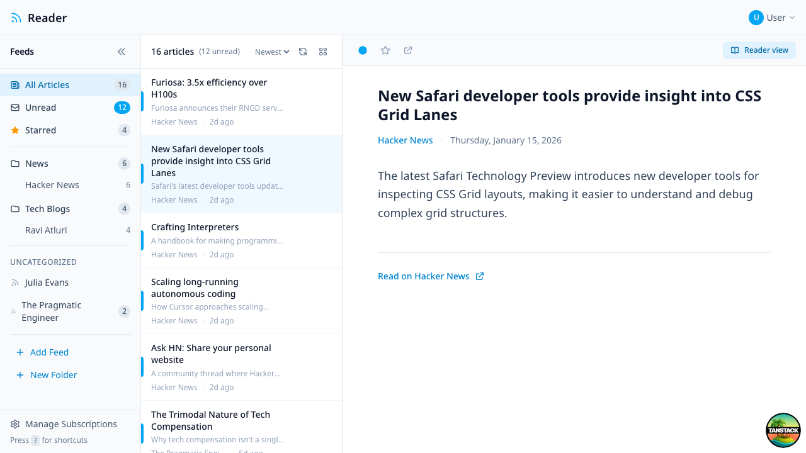

# Reader

Do you remember Google Reader?

I do.

I miss it.

I miss the simplicity of it.

I miss sharing articles & comments with my friends.

This is an attempt to bring back the simplicity of Google Reader using Claude & Friends.



## Features

- 3-pane layout (folders | article list | reading pane)
- Subscribe to RSS/Atom feeds
- Read/unread article tracking
- Folder organization for feeds
- Keyboard navigation (j/k/o shortcuts)
- List and card view toggle for article list

## Tech Stack

- **Framework**: TanStack Start (React 19 + Vite 7)
- **Styling**: Tailwind CSS v4
- **Database**: SQLite via `bun:sqlite`

## Getting Started

```bash
# Install dependencies
bun install

# Start dev server
bun --bun run dev

# Run tests
bun --bun test
```

## License

MIT
