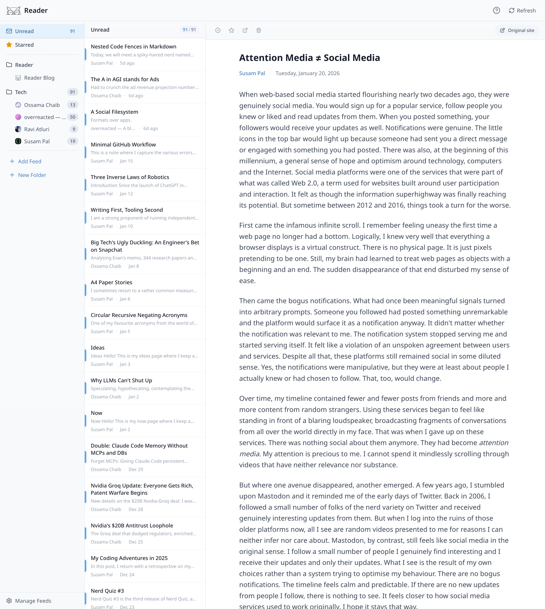

Do you remember Google Reader?

I do. I miss it. I miss the simplicity of it.

This is an attempt to bring back that simplicity.

## Features

- 3-pane layout (folders | feeds | reading pane)
- Subscribe to RSS/Atom feeds
- Keyboard navigation (j/k for articles, o to open)
- Folder organization
- Read/unread tracking with unread counts
- Star articles for later
- OPML import/export

## Getting Started

```bash
pnpm install
pnpm dev
```

## Tech

Client-side SPA built with TanStack Start (React 19). All data stored locally in IndexedDB via TanStack DB. Feed parsing runs in a web worker.

## License

MIT
